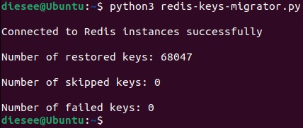
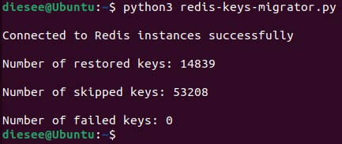
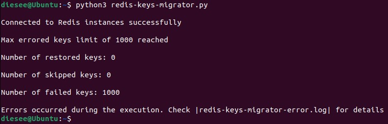
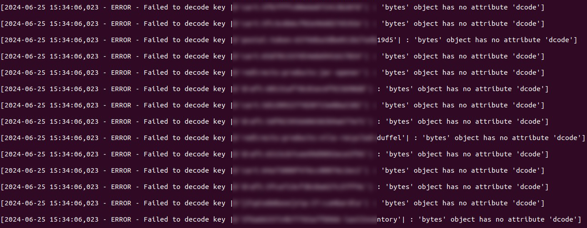

# 🏄 Introduction 🏄

* This project contains a script that can be used to migrate keys between `Redis hosts`.

* Configuration supposes that you should have two active Redis instances. For example, if you have only the destination host and `.rdb` backup that you want to upload there, consider the following (`redis-server` must be installed) :

```
mkdir ${DESIRED_PATH}
download the `.rdb` file in the created directory
redis-server --port ${PORT} --dir ${DESIRED_PATH} --dbfilename ${FILENAME}

# Example :
mkdir /home/ubuntu/source-redis-server
mv source-redis-server-backup.rdb /home/ubuntu/source-redis-server
redis-server --port 6380 --dir /home/ubuntu/source-redis-server/ --dbfilename source-redis-server-backup.rdb
```

> [!CAUTION]
> * Unfortunately, `Redis clusters` are not supported (perhaps, this will be added in the future).

# ⚙️ How it works ⚙️

* The script performs the following :

  * using `SCAN`, get keys by batches from the source instance;
 
  * checks if the key exists in the destination host (by default, existing keys are omitted);
 
  * gets key type & value;
 
  * migrate key in the destination host.
 
* The script is configured not to touch existing keys in the destination host (if the destination contains the same key as the source, the script will skip that key).

# 🤿 Deep dive into the script logic 🤿

* TL;DR =)

* First of all, you should define the following `variables` :

  * `DESTINATION_REDIS_HOST` - destination Redis host endpoint (without port);
 
  * `DESTINATION_REDIS_PORT` - destination Redis host port;
 
  * `DESTINATION_REDIS_DB_INDEX` - the database index in the destination Redis host (default `0`);
 
  * `SOURCE_REDIS_HOST` - source Redis host endpoint (without port);
 
  * `SOURCE_REDIS_PORT` - source Redis host port;
 
  * `SOURCE_REDIS_DB_INDEX` - the database index in the source Redis host (default `0`);
 
  * `SCAN_MATCH_PATTERN` - defines keys that should be migrated (default `*`). For example, `*` selects all keys, `643*` selects keys whose names begin with `643`;
 
  * `SCAN_BATCH_SIZE` - how many keys to retrieve from the source instance by one `SCAN` iteration (default `1000`);
 
  * `PIPELINE_BATCH_SIZE` - sets the number of commands sent inside one pipeline for the destination host (default `1000`). Read about Redis pipelining below;
 
  * `MAX_PROCESSED_EXISTING_KEYS_LIMIT` - defines the number of processed existing keys after which to offload CPU (default `1000`);
 
  * `SLEEP_TIME` - the amount of time in seconds to offload CPU (default `1`). Read about CPU offloading below;
 
  * `ERROR_LOG_FILENAME` - the name of the file for `ERROR` logs (default `redis-keys-migrator-error.log`). Read about error handling below;
 
  * `FILEMOD` - in which mode to open the `ERROR_LOG_FILENAME` for logging (default `w`). Read about error handling below;
 
  * `MAX_ERRORED_KEYS_LIMIT` - sets the limit of errored key migrations (default `1000`). Reaching this value stops the script execution.
 
* **[Redis pipelining](https://redis.io/docs/latest/develop/use/pipelining/)**
  * Redis pipelining is a technique for improving performance by issuing multiple commands at once without waiting for the response to each individual command.

  * In our case, the pipeline contains only direct key migration commands. Pipeline executes when it accumulates `PIPELINE_BATCH_SIZE` commands. The script assumes the execution of the pipeline for the last iteration of the keys when the `PIPELINE_BATCH_SIZE` value was not reached.
 
* **CPU offloading**

  * CPU offloading is necessary to reduce `CPU consumption` on the Redis instances and machine where the script is executed.
 
  * `time.sleep(SLEEP_TIME)` runs after each pipeline execution (if not last) or the `MAX_PROCESSED_EXISTING_KEYS_LIMIT` value reaches. This approach significantly offloads resource usage.
 
  * We conducted testing with the `default variables values` on the local virtual machine with `3 vCPUs, 8 GB Memory & 2 Redis servers running` (the source had over `100k keys`, the destination was `blank`). The results are the following :
 
    * without `time.sleep(SLEEP_TIME)` :
   
      * `script CPU usage` ~40-70%, Memory usage not more than 10%;
     
      * `redis-servers` CPU usage ~10-30%, Memory usage not more than 10%;
     
      * **~40 seconds to migrate 100k keys.**
     
    * with `time.sleep(SLEEP_TIME)` :

      * `script CPU usage` ~20%, Memory usage not more than 10%;
     
      * `redis-servers` CPU usage ~10%, Memory usage not more than 10%;
     
      * **~180 seconds to migrate 100k keys.**
     
  * As you can see, `time.sleep(SLEEP_TIME)` significantly reduces resouce consumption. Yes, this slows the migration process, but, anyway, 100k keys in 3 minutes sounds good.

  * Variables below control the following :

    * `SCAN_BATCH_SIZE` - load on the source Redis instance;
   
    * `PIPELINE_BATCH_SIZE` - load on the destination Redis instance and machine where the script is executed;
   
    * `MAX_PROCESSED_EXISTING_KEYS_LIMIT` - load in general when a lot of keys already exist in the destination instance.
   
  * **The main thing that consumes resources is the `pipeline`. We recommend setting a smaller value for the `PIPELINE_BATCH_SIZE` if you face high CPU usage. For example, `PIPELINE_BATCH_SIZE=100` reduced CPU usage to not more than ~5%, but the migration process became significantly longer.**
 
* **Erorr handling**

  * The script automatically exits if a connection can't be established to one of the Redis instances in the beginning.
 
  * All error messages, related to the key processing, are written to the file with the name you specify through the `ERROR_LOG_FILENAME` variable. This file will be created automatically in the directory from which the script was run.
 
  * If any errors occur during the execution you'll be notified about that in the console with the `last output message` (example) :
 
  ```
  Errors occurred during the execution. Check |redis-keys-migrator-error.log| for details
  ```
 
  * The `FILEMOD` variable specifies the mode in which you’d like to work with the log file. Setting the file mode to write (`w`) will overwrite the logs every time the script is run. Another possible mode is append (`a`) which means you’ll have a log record of events across all runs of the program.
 
  * With `MAX_ERRORED_KEYS_LIMIT` you can control when to stop the script execution depending on the number of failed key processing.

# ◻️ Miscellaneous ◻️

* If you want to delete keys in the destination host that are present in the source instance, add the following to the script (the `if` block must be on the same level as the existing `if not` condition). Keep in mind it'll increase resource usage!

```     
        # Delete existing keys
        if destination_redis.exists(key):
            destination_redis.delete(key)
```

* If you need to pass any additional parameters inside Redis connections (`password`, etc) refer to **[redis-py dev documentation](https://redis-py.readthedocs.io/en/stable/connections.html)**.

* How the execution process looks like :

  * full migration :
 
    

  * migration with skipped keys :
 
    

  * script failure :
 
    

    


# ✔️ Requirements ✔️

> [!IMPORTANT]
> * `Python 3.8+`
> 
>  * Install dependencies :
> 
> `Python versions < 3.12`
> 
> ```
> pip install -U -r requirements.txt
> ```
> 
> `Python versions >= 3.12 don't support the |redis| package currently, so the creation of the |venv| is required`
> 
> ```
> python3 -m venv ${DESIRED_PATH}
> source ${DESIRED_PATH}/bin/activate
> pip install -U -r ${PATH}/requirements.txt
> deactivate
>
> # Example
> python3 -m venv /home/ubuntu/redis-migration
> source /home/ubuntu/redis-migration/bin/activate
> pip install -U -r /home/ubuntu/redis-keys-migrator/requirements.txt
> deactivate
> ```

# ⛵ Usage guide ⛵

* Make sure you finish the `Requirements` block steps.

* Set desired values for `all variables`.
 
* Run `Python script` :

```
# Python versions < 3.12
python3 ${PATH_TO_SCRIPT}

# Example
python3 /home/ubuntu/redis-keys-migrator/redis-keys-migrator.py

# Python versions >= 3.12
source ${DESIRED_PATH}/bin/activate
python3 ${PATH_TO_SCRIPT}
deactivate

# Example
source /home/ubuntu/redis-migration/bin/activate
python3 /home/ubuntu/redis-keys-migrator/redis-keys-migrator.py
deactivate
```

* If your source Redis instance has a lot of keys it can take some time for the script to finish, so do not hurry up canceling script execution.

# 📑 Examples 📑

> [!NOTE]
> This block is designed to show different use cases of the script.

*For example, you have an `AWS ElastiCache` instance running and there is a need to migrate keys into it from backup.*

* Manually export desired `ElastiCache backup` to `S3` or use the AWS CLI (if the snapshot is big it can take some time to complete, so monitor the `S3 bucket` for the new file) : 

  * get snapshots list (`--cache-cluster-id` is a `Primary` `Node name`; you can get this value by clicking on the desired Redis cache in the AWS Management Console and scrolling down to the `Nodes` section) : 

    ```
    aws elasticache describe-snapshots --cache-cluster-id ${CLUSTER_ID} > test-file.yaml
    
    # Example
    aws elasticache describe-snapshots --cache-cluster-id production-001 > test-file.yaml
    ```

  * look for the needed backup name inside the file and copy the snapshot to `S3` : 

    ```
    aws elasticache copy-snapshot --source-snapshot-name ${SNAPSHOT_NAME} --target-snapshot-name ${SNAPSHOT_NAME} --target-bucket ${S3_BUCKET}
    
    # Example
    aws elasticache copy-snapshot --source-snapshot-name production --target-snapshot-name production --target-bucket redis-backups-bucket
    ```

* Provision `EC2 instance` in the **same VPC** as `ElastiCache` with the following parameters : 

  * `Name`- any you wish (e.g. `redis-migration`);

  * `OS settings` - `Ubuntu 24.04` with `x86` architecture;

  * `Instance type` - in general, the system should have at least `2 vCPUs` and `x2` from the current `Redis RAM` usage;

  * `Key pair` - if you have a private key from the list of key pairs, select that item. If no, create a new key pair and select it;

  * `Network settings` : 

    * select desired `VPC`;

    * choose any `public subnet` : 

    * `Enable` for `Auto-assign public IP`;

    * configure `Security groups` (you should provide SSH access to the EC2 instance).

  * `Storage` - `30 GiB gp3`;

  * `Advanced details` : 

    * `IAM instance profile` - provide a `Role` that grants access to execute `aws s3 cp` on the `S3 bucket` with `ElastiCache backups`;

    * `User data` (set your values for the `RDB_BACKUP` & `S3_BUCKET` variables; e.g. `production.rdb` & `my-bucket`; you can change the remaining variables but this will also require changes in the post-SSH commands on the EC2 instance) : 

      ```
      #!/bin/bash
      
      # Variables
      WORKDIR=/home/ubuntu
      RDB_BACKUP=input_value
      VENV_DIRECTORY=redis-migration
      GIT_CLONE_DIRECTORY=redis-keys-migrator
      S3_BUCKET=input_value
      LOCAL_REDIS_SERVER_DIRECTORY=redis-server-local
      LOCAL_REDIS_SERVER_PORT=6380
      
      # Install Redis packages
      apt update
      apt install -y redis-server
      sysctl vm.overcommit_memory=1
      
      # Install Python packages
      apt install -y python3-pip
      apt install -y python3-venv
      
      # Create a Python virtual env
      python3 -m venv $WORKDIR/$VENV_DIRECTORY
      
      # Download |redis-keys-migrator| tool
      git clone https://github.com/itsyndicate/redis-keys-migrator.git $WORKDIR/$GIT_CLONE_DIRECTORY
      
      # Install Python requirements for the virtual env
      source $WORKDIR/$VENV_DIRECTORY/bin/activate
      pip install -U -r $WORKDIR/$GIT_CLONE_DIRECTORY/requirements.txt
      deactivate
      
      # Install AWS CLI
      snap install aws-cli --classic
      
      # Create a directory for the local Redis server
      mkdir $WORKDIR/$LOCAL_REDIS_SERVER_DIRECTORY
      
      # Copy .rdb snapshot from S3 to the local Redis server folder
      aws s3 cp s3://$S3_BUCKET/$RDB_BACKUP $WORKDIR/$LOCAL_REDIS_SERVER_DIRECTORY/
      
      # Run local Redis server
      redis-server --port $LOCAL_REDIS_SERVER_PORT --dir $WORKDIR/$LOCAL_REDIS_SERVER_DIRECTORY/ --dbfilename $RDB_BACKUP
      ```

* Wait ~2 minutes and SSH on the launched EC2 instance : 

  * take `public IP` from the AWS Management Console;

  * user - `ubuntu`;

  * port - `22`;

  * private key - select the same as you defined during the EC2 instance creation.

* Follow the process below : 

  ```
  # Switch user
  sudo su
  
  # Check amount of keys in the local Redis server
  redis-cli -p 6380 SCAN 0 MATCH '*' COUNT 1000000
  
  # Activate Python venv
  source redis-migration/bin/activate
  
  # Verify |redis/hiredis| packages are installed
  pip list
  
  # Modify Python script
  nano redis-keys-migrator/redis-keys-migrator.py
  
  # Set the following values for variables :
  DESTINATION_REDIS_HOST = "${AWS_ELASTICACHE_DESTINATION_ENDPOINT}"
  DESTINATION_REDIS_PORT = ${AWS_ELASTICACHE_DESTINATION_ENDPOINT_PORT}
  SOURCE_REDIS_PORT = 6380
  
  # Run Python script
  python3 redis-keys-migrator/redis-keys-migrator.py
  
  # Deactivate the venv when done
  deactivate
  ```

* Verify keys in the destination host : 

  ```
  redis-cli -p ${AWS_ELASTICACHE_ENDPOINT_PORT} -h ${AWS_ELASTICACHE_ENDPOINT} SCAN 0 MATCH '*' COUNT 1000000
  ```

* **If everything is well terminate the EC2 instance.**

<br/>
 
*If you have `two AWS ElastiCache` instances everything is the same except for some changes described below.*

* You don’t need to export any backups to `S3` and set the `IAM instance profile`.

* `User data` :

  ```
  #!/bin/bash
  
  # Variables
  WORKDIR=/home/ubuntu
  VENV_DIRECTORY=redis-migration
  GIT_CLONE_DIRECTORY=redis-keys-migrator
  
  # Install Redis packages
  apt update
  apt install -y redis-tools
  
  # Install Python packages
  apt install -y python3-pip
  apt install -y python3-venv
  
  # Create a Python virtual env
  python3 -m venv $WORKDIR/$VENV_DIRECTORY
  
  # Download |redis-keys-migrator| tool
  git clone https://github.com/itsyndicate/redis-keys-migrator.git $WORKDIR/$GIT_CLONE_DIRECTORY
  
  # Install Python requirements for the virtual env
  source $WORKDIR/$VENV_DIRECTORY/bin/activate
  pip install -U -r $WORKDIR/$GIT_CLONE_DIRECTORY/requirements.txt
  deactivate
  ```

* Minor changes to commands after SSH on the EC2 instance : 

  ```
  # If you need to use redis-cli for the source host specify the endpoint with the -h flag
  # Example
  redis-cli -p ${AWS_ELASTICACHE_SOURCE_ENDPOINT_PORT} -h ${AWS_ELASTICACHE_SOURCE_ENDPOINT} SCAN 0 MATCH '*' COUNT 1000000

  # Set the following values for script variables :
  DESTINATION_REDIS_HOST = "${AWS_ELASTICACHE_DESTINATION_ENDPOINT}"
  DESTINATION_REDIS_PORT = ${AWS_ELASTICACHE_DESTINATION_ENDPOINT_PORT}
  SOURCE_REDIS_HOST = "${AWS_ELASTICACHE_SOURCE_ENDPOINT}"
  SOURCE_REDIS_PORT = ${AWS_ELASTICACHE_SOURCE_ENDPOINT_PORT}
  ```

# 💡 Contribution 💡

* We'll be very thankful for any ideas, improvements, bug reports, etc. Feel free to open `Issues` 🤗

# 📜 License 📜
* `Apache 2 Licensed`. See **[LICENSE](https://github.com/itsyndicate/redis-keys-migrator/blob/main/LICENSE)** for full details.

# 🛠️ Maintainers 🛠️

* **[plain5](https://github.com/plain5)**
